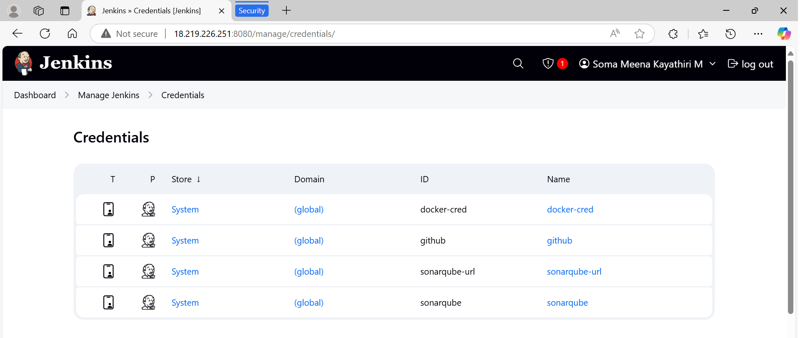

# Jenkins CI/CD Pipeline with ArgoCD Integration

## Overview
This project demonstrates a complete CI/CD pipeline for a Spring Boot application, leveraging Jenkins for automation and ArgoCD for deployment to a Kubernetes cluster. The pipeline includes building, testing, vulnerability scanning, and deploying the application.

---

## Features
- **Automated Build**: Uses Maven to compile and package the Spring Boot application.
- **Static Code Analysis**: Integrates SonarQube to ensure code quality.
- **Unit Testing**: Runs automated tests to verify application functionality.
- **Docker Integration**: Builds and pushes Docker images to Docker Hub.
- **Security Scanning**: Uses Trivy to scan Docker images for vulnerabilities.
- **Deployment**: Deploys to a Kubernetes cluster using ArgoCD.

---

## Prerequisites
1. **Jenkins Setup**:
   - Jenkins server with Docker installed.
   - Required plugins: Docker Pipeline, Git, Pipeline: Multibranch.
2. **Docker Hub Account**: For storing Docker images.
3. **SonarQube**: Configured with an authentication token.
4. **ArgoCD**: Installed on the Kubernetes cluster.
5. **Kubernetes Cluster**: Ensure `kubectl` is configured for your cluster.
6. **GitHub Repository**: Contains the Spring Boot application and Kubernetes manifests.

---

## Project Structure
```
.
├── spring-boot-app/                # Spring Boot application source code
│   ├── Jenkinsfile                 # Defines the Jenkins pipeline
├── spring-boot-manifest/           # Kubernetes manifests for deployment
│   ├── deployment.yml              # Kubernetes deployment configuration
│   └── service.yml                 # Kubernetes service configuration
└── README.md                       # Project documentation
```

---

## Jenkins Installation
1. Update the system and install Java Runtime:
   ```bash
   sudo apt update
   sudo apt install openjdk-17-jre -y
   ```
2. Add the Jenkins repository key:
   ```bash
   curl -fsSL https://pkg.jenkins.io/debian/jenkins.io-2023.key | sudo tee /usr/share/keyrings/jenkins-keyring.asc > /dev/null
   ```
3. Add the Jenkins repository to your system:
   ```bash
   echo deb [signed-by=/usr/share/keyrings/jenkins-keyring.asc] https://pkg.jenkins.io/debian binary/ | sudo tee /etc/apt/sources.list.d/jenkins.list > /dev/null
   ```
4. Install Jenkins:
   ```bash
   sudo apt-get update
   sudo apt-get install jenkins -y
   ```
5. For AWS EC2, ensure port 8080 (TCP) is open in the security group settings.

6. Install docker in AWS EC2
   ```bash
   sudo apt update
   sudo apt install docker.io
   ```
   Give User permission to Jenkins
   ```bash
      sudo su - 
      usermod -aG docker jenkins
      usermod -aG docker ubuntu
      systemctl restart docker
   ```
---

## SonarQube Installation
1. Install required dependencies:
   ```bash
   sudo apt install unzip
   sudo adduser sonarqube
   ```
2. Switch to the SonarQube user:
   ```bash
   sudo su - sonarqube
   ```
3. Download and install SonarQube:
   ```bash
   wget https://binaries.sonarsource.com/Distribution/sonarqube/sonarqube-9.9.8.100196.zip
   unzip sonarqube-9.9.8.100196.zip
   chmod -R 755 sonarqube-9.9.8.100196
   chown -R sonarqube:sonarqube sonarqube-9.9.8.100196
   cd sonarqube-9.9.8.100196/bin/linux-x86-64/
   ./sonar.sh start
   ```
4. For AWS EC2, ensure port 9000 (TCP) is open in the security group settings.

---


## Adding Credentials in Jenkins

### 1. Add Docker Credentials
- Go to **Manage Jenkins** > **Credentials** > **Global credentials (unrestricted)** > **Add Credentials**.
- Select **Username with password**:
  - **Username**: Your Docker Hub username.
  - **Password**: Your Docker Hub password.
  - **ID**: Set an ID (e.g., `docker-cred`).

### 2. Add SonarQube Token
- Generate a token in SonarQube:
  - Log in to SonarQube > Go to **My Account** > **Security** > **Generate Token**.
- In Jenkins:
  - Go to **Manage Jenkins** > **Credentials** > **Global credentials (unrestricted)** > **Add Credentials**.
  - Select **Secret text**:
    - **Secret**: Paste the token generated in SonarQube.
    - **ID**: Set an ID (e.g., `sonarqube`).

### 3. Add GitHub Token
- Generate a personal access token in GitHub:
  - Go to **GitHub Settings** > **Developer Settings** > **Personal Access Tokens** > **Generate New Token**.
  - Select necessary scopes (e.g., `repo`).
- In Jenkins:
  - Go to **Manage Jenkins** > **Credentials** > **Global credentials (unrestricted)** > **Add Credentials**.
  - Select **Secret text**:
    - **Secret**: Paste the token generated in GitHub.
    - **ID**: Set an ID (e.g., `github`).

### 4. Add SonarQube URL
- In Jenkins:
  - Go to **Manage Jenkins** > **Credentials** > **Global credentials (unrestricted)** > **Add Credentials**.
  - Select **Secret text**:
    - **Secret**: Paste your SonarQube server URL (e.g., `http://your-sonarqube-server`).
    - **ID**: Set an ID (e.g., `sonarqube-url`).


Screenshot for jenkins credentials




---


## Pipeline Stages
1. **Build Maven**: Compiles and packages the application.
2. **Static Code Analysis**: Analyzes code with SonarQube.
3. **Unit Testing**: Runs test cases.
4. **Build and Push Docker Image**: Creates a Docker image and pushes it to Docker Hub.
5. **Trivy Scan**: Scans the Docker image for vulnerabilities.
6. **Update Deployment Manifest**: Updates the Kubernetes manifest with the new image version.
7. **Deploy with ArgoCD**: Deploys the application using ArgoCD.

---

## Installation and Setup

### 1. **Clone the Repository**
```bash
git clone https://github.com/somameenakayathirim/Jenkins-End-to-End-CI-CD-Project.git
cd Jenkins-End-to-End-CI-CD-Project
```

### 2. **Create a Jenkins Pipeline**
Follow these steps to create a Jenkins pipeline pointing to the `Jenkinsfile` inside the `spring-boot-app` folder:
1. Open Jenkins and click on **New Item**.
2. Enter a name for the pipeline and select **Pipeline** as the project type.
3. In the project configuration, scroll to **Pipeline** and select **Pipeline script from SCM**.
4. Under **SCM**, choose **Git**.
5. Enter the repository URL: `https://github.com/somameenakayathirim/Jenkins-End-to-End-CI-CD-Project.git`.
6. Specify the path to the `Jenkinsfile`: `spring-boot-app/Jenkinsfile`.
7. Save the configuration and build the pipeline.

Screenshots to create Jenkins Pipeline 


Select the branch and give JenkinsFile path as below


### 3. **Launch a Minimal AWS EKS Cluster**
- Create an EKS cluster.
```bash
eksctl create cluster --name sample-cluster --region <your-region> --nodes 1 --node-type t2.medium --with-oidc --ssh-access --ssh-public-key <your-ssh-key-name> --managed
```
- Configure `kubectl` to use the new cluster:
```bash
aws eks update-kubeconfig --name sample-cluster --region <your-region>
```

### 4. **Install ArgoCD**
- Create a namespace and install ArgoCD:
```bash
kubectl create namespace argocd
kubectl -n argocd apply -f https://raw.githubusercontent.com/argoproj/argo-cd/stable/manifests/install.yaml
kubectl patch svc argocd-server -n argocd -p '{"spec": {"type": "LoadBalancer"}}'
```
- Retrieve the ArgoCD admin password:
```bash
kubectl get secret argocd-initial-admin-secret -n argocd -o jsonpath="{.data.password}" | base64 -d
```

Below screenshot to verify argocd is installed properly.


### 5. **Deploy Application Using ArgoCD**
- Access the ArgoCD UI with external IP of argocd-server and give admin as username and password generated at above step.
- Create a new application:
  - GitHub Repository: `https://github.com/somameenakayathirim/Jenkins-End-to-End-CI-CD-Project.git`
  - Path: `spring-boot-manifest`
  - Sync the application.


---

## Usage
1. Trigger the Jenkins pipeline to start the CI/CD process.
2. Monitor pipeline stages for build, test, and scan results.


3. Check the deployment status in the ArgoCD UI by syncing the application.


4. Verify the application is running in the Kubernetes cluster and note down the external ip of spring-boot-app-service to access the application
   ```bash
   kubectl get pods 
   kubectl get svc
   ```

   

5. Verify the application is launched in browser


---

## Troubleshooting
- **Jenkins Pipeline Errors**:
  - Ensure all credentials are correctly configured in Jenkins.
  - Check Jenkins logs for detailed error messages.
- **ArgoCD Sync Issues**:
  - Verify repository and path configurations.
  - Check ArgoCD logs for deployment errors.

---


